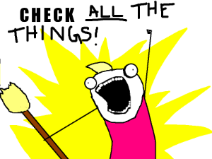
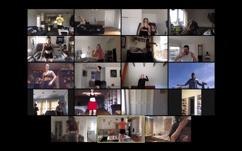
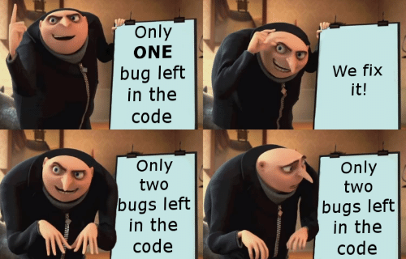
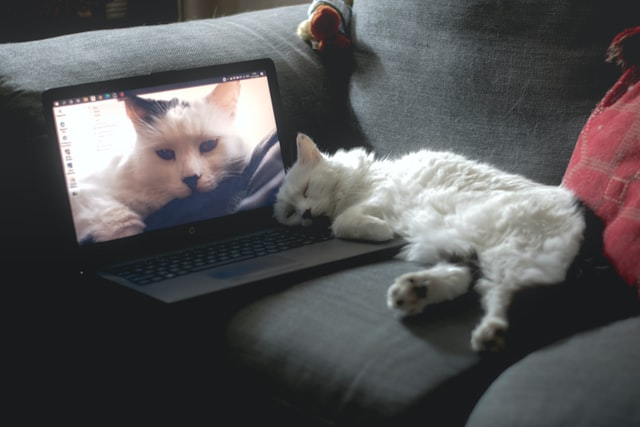
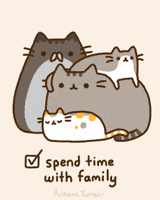

# A Day in the Life of an Adie

No two Adies are exactly the same and neither are two Adie schedules.  We surveyed a few Adies and mashed their schedules together to come up with this rough guide to how you'll spend your day as an Adie!

## 9:00am - 9:30am

Wake up, Breakfast, Check Calendar, Slack, Email, Learn.

  
[(source)](http://hyperboleandahalf.blogspot.com/2010/06/this-is-why-ill-never-be-adult.html)

## Seattle Campus: 9:30am - 10:30am or 10:50am - 11:50am PST
## Digital Campus: 9:30am - 11:00am PST

Roundtables.

  
[(source)](https://www.vice.com/en/article/n7jaex/dance-church-is-thousands-of-peoples-favorite-quarantine-workout)

## 11:50am - 12:00pm

Stretch Break!

  
[(source)](https://www.petguide.com/blog/cat/whats-cats-stretching/)

## 12:00pm - 1:00pm

Lunch.

  
[(source)](https://giphy.com/gifs/sesamestreet-xT0xeMA62E1XIlup68)

## All Afternoon

Ask for Help!  Slack or Office Hours on Zoom are great ways to get help.

  
[(source)](https://giphy.com/gifs/schittscreek-schittscreek-pop-poptv-comedy-tv-funny-eugenelevy-danlevy-l0IycEw2wscAQzG6Y)

## 1:00pm - 2:30pm

Online meetings if any (Retro, Homeroom, etc).

  
[(source)](https://tenor.com/view/bird-call-zoom-zoom-meeting-video-call-house-party-gif-18994265)

## 2:00pm - 5:00pm

Read Code, Write Code, Think About Code...

  
[(source)](https://me.me/i/only-one-bug-left-in-the-code-we-fix-it-21102264)

## 3:00pm - 3:30pm

See the Sunshine!  Go outside and get some fresh air.

  
[(source)](https://pixabay.com/photos/puppy-run-running-dog-pet-animal-5193507/)

## 4:00pm

Talk to other Adies.  Co-work, study together, help each other!

  
[(source)](https://unsplash.com/photos/d6n3J882SkM)

## 5:00pm - 9:00pm

Dinner, Decompress, Family Time!

  
[(source)](https://giphy.com/gifs/augh-AmQ3y8XsZq9Q4)

## 8:00pm - 11:00pm

Watch lessons for tomorrow.

  
[(source)](https://tenor.com/view/computer-cat-working-gif-7817705)

## 10:00pm - 11:00pm

Go to Sleep.

  
[(source)](https://www.boredpanda.com/sleeping-dogs-human-bed/?media_id=214798)
