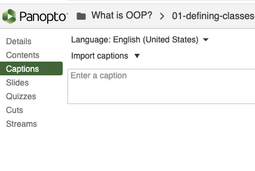

# Video Guidelines

This is a **brief** guide for instructors on how to create video lessons for students.

## Video Tooling

At Ada we have a few tools available for making video lessons:

* **[Panopto](https://adaacademy.hosted.panopto.com/)** - Panopto is a company that provides lecture recording, screencasting and video streaming to Ada.  
  * Most importantly all the storage space on the Panopto servers is free to Ada as a donation.  Panopto provides embed codes for all videos via an iframe tag.
  * It also provides a [screencasting tool](https://adaacademy.hosted.panopto.com/Panopto/Cache/10.3.1.00010/Software/Panopto%20Recorder.pkg?arch=None&useCustomBinary=True) which can record the screen and webcam and automatically upload to panopto.  The tool is very _simple and basic_, but it does work and is easy to use.
  * Panopto also allows us to string videos together into playlists.  This lets us make short vidoes covering specific topics in longer lessons.
    * I (Chris) have chosen to name my video files with numbers to make sure I keep the order correct.
* **[Zoom](https://zoom.us)** - Zoom is our video conferencing software and it provides a way to record meetings which works pretty well.  
  * You can record any meeting and download it to your computer and then upload the results to Panopto.  This is an outstanding way to do a _dual instructor lesson_.

## In General

- **Don't just read the lesson aloud**
  - Remember that the video is a lesson, and does not have to involve reading the Learn curriculum line-by-line.  You can provide alternative examples of the same points.
  - The key is you want to teach the same concepts as the Learn lesson, and not have a key concept taught in the video which is missing from the text.  Supplementary "neato" tricks are fine.
- **Demonstrate Code!**
  - Some of the text lessons are by necessity text-dense.  The nice thing about the video is you can explain the concept verbally while illustrating it with a code sample.
- **Draw!**
  - It can be really handy to use Zoom Annotations, or a [drawing app](https://app.diagrams.net/) to sketch out an illustration while you teach the concept aloud.  
    - Feel free to add the finished product to the Learn lesson as well!  🐥🐥 for 🪨
- **Come Back to the learning goals**
  - Talk about the learning objectives in the beginning.
  - Come back to them at the end and connect them to the topics discussed (great review)
- **Keep it short!**
  - The ideal video should be less than ~10 minutes.  Try never to go more than ~20 as that becomes a real slog for students.  It's also harder for them to focus in on a difficult concept if they have to hunt through the video to find things.
  - You can break up a long lesson into short videos and use a playlist to put 'em together.
- **When you remember: add captions**
  - Panopto can do automatic captions, but you have to go into the video in the site and "import automatic captions".

- **Make mistakes**
  - I (Chris) am going to maintain I do this intentionally, and you can't prove otherwise.
  - Mistakes in the video allow us to pause and ask the student, "What happened here?"  Give them a chance to guess at the answer and/or pause the video to try to solve the problem.  Then you can show them how you resolve the problem/mistake.
  - You can work errors into your lessons and ask students to take a moment to solve the problem, and then make it into a mini-lesson about how to debug or research problems.
  - Mistakes also help humanize you to students
- **Give practice**
  - Mistakes above can serve this purpose, but you can give students a question or problem and ask them to pause the video and figure it out, and then work through how you resolve things.
  - You can also use the Learn Challenges in the curriculum.
- **Be Aware of where the thumbnail will be**
  - Both Panopto and Zoom put thumbnails of the speaker in a fixed location in the video.  *Don't put code where it will be covered up!*  This is usually the top-right side.
  - Camtasia does allow you to shift the location of the thumbnail in editing.

## Workflow

To help adding video lessons the flow goes like this:

1.  Find the [Video content Airtable](https://airtable.com/tblXx1WLkPwJqp46T)
1.  Identify a video assigned to you, or pick one which is unclaimed
1.  Review the lesson, make suggestions/edits for the curriculum team.
1.  Mark the video as "In Progress" in the airtable
1.  Record the lesson making edits as needed
1.  Upload the video lessons to [panopto](https://adaacademy.hosted.panopto.com/Panopto/Pages/Sessions/List.aspx#folderID=%22bf8fa6c1-e3d3-46b2-b3f9-accb01698ec1%22)
1.  Create a playlist (even for a 1 video lesson) and attach videos to it. 
      - Check the videos in the playlist to verify the order please! 
2.  Place the embedded iframe for the playlist into the learn lesson.
3.  Git-add-commit and learn publish the lesson
4.  Watch at least a bit of each video, just to make SURE you didn't make a mistake 😊
5.  Mark the lesson as done in the airtable.

## Suggested Panopto Organization

Organize a folder based on the repository the lessons are for (Core Unit 1 for example).  Inside that folder create a folder for each Topic (square in learn) and the videos for that Topic and their playlists go into it.  Each resource (markdown file) should have its own playlist. (If there's only one video for a resource, no need to make a playlist. You can just embed the single video.) This makes it a bit easier to move things around in Panopto and it mirrors the Learn organization for newcomers.

It would likely be a good idea to create a folder outside of a cohort to semi-permanently host the videos.  Currently we are using the CXX (eg. C15) folder in Panopto.  Luckily folders and files are easy to move or copy in Panopto.

## Questions To Answer Over Time

These are questions I have about best-practices that we'll have to answer over time.

- Do I need to have my face/thumbnail on videos?
  - I (Chris) am unconvinced that the thumbnail of our lovely faces is helpful for learning.  Personally I think it distracts from the code we want them to follow and concepts we want students to learn.  That said, it helps students maintain a human connection to their instructors and several students (C13) have asked to keep them.
- Do we need more production value (intro screens, editing etc)?
  -  Would higher production values give us any "bang for our buck?"  Currently I (Chris) do not think so.  Especially as we're not selling the videos, it's probably not worthwhile.
  -  I (Chris) do have a license for Camtasia and it adds a 5 sec intro animation, which probably doesn't distract from learning, and it looks nice.
- Should we invest in alternative software?
  - If Panopto shifts to a different liscense or goes under, Youtube or other streaming services could be used.  We should look into a backup storage service.  I (Chris) am storing mine on a used NAS I bought for myself as a backup.
  - [Camtasia](https://www.techsmith.com/camtasia-upgrade.html) is a good and widely used software package to do screencasting in education.  It is pretty easy to add some production value to a video and add neat effects. 
- Video Reviews?  
  - Right now I (Chris) don't think we have the time with the new Python curriculum, but over time maybe we can work in a video review process similar to how we do curriclum review.
