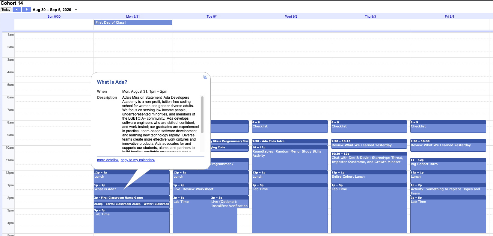
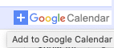
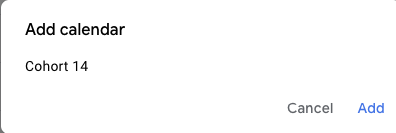

# Google Calendar

At Ada we use Google calendar to schedule lessons, meetings and homework. Please find the C16 Google calendars below.

* [Seattle Google Calendar](https://calendar.google.com/calendar/u/0?cid=Y19rZ3VxbDZ1MXVqcjB0Z3I4c2Q0b2I1Nmc4c0Bncm91cC5jYWxlbmRhci5nb29nbGUuY29t)
* [Digital Google Calendar](https://calendar.google.com/calendar/embed?src=c_5f463b1m1a0umrfmfvja8dnao8%40group.calendar.google.com&ctz=America%2FLos_Angeles)

Please find the TA Calendars below.

* [C16 Digital TA Google calendar](https://calendar.google.com/calendar/u/0?cid=Y19zYnYwbTZqNGZ0Mmt2aTN1dHBlbWpoMGVoZ0Bncm91cC5jYWxlbmRhci5nb29nbGUuY29t)
* [C16 Seattle TA Google calendar](https://calendar.google.com/calendar/u/0?cid=Y18zZmIzdmF2cjhudjNmNDd2cWVyc2psdmwzb0Bncm91cC5jYWxlbmRhci5nb29nbGUuY29t)

<iframe src="https://adaacademy.hosted.panopto.com/Panopto/Pages/Embed.aspx?id=e1469d77-e54e-414b-96a9-ac1800578b41&autoplay=false&offerviewer=true&showtitle=true&showbrand=false&start=0&interactivity=all" height="405" width="720" style="border: 1px solid #464646;" allowfullscreen allow="autoplay"></iframe>

## Subscribing to Google Calendar

You can subscribe to a Google calendar, if you have a Google account, by clicking on the `+ Google Calendar` image at the bottom right of the screen.

You can also sync the calendar with [Calendar on Mac](https://www.howtogeek.com/tips/how-to-add-your-gmail-calendar-to-the-calendar-on-mac-os-x/).

## Calendar Norms

This is our source of truth for itinerary per day. **The exception is if we make a more immediate adjustment that is communicated via Slack.**

Every event has a title, length/duration, and event details.

The event details will contain important links, resources, details, etc. **Event details will often include the links to the Zoom call you need to join at that time.**

Here are some events that you will see frequently on your calendar:

- **Checklist**: Daily 8am-9am event. The event details contain everything we expect/hope that you accomplish before the following day. The checklist has two sections:
    - Daily Tasks: This includes things like lessons and problem sets
    - Ongoing Tasks: This includes things like projects
- **Roundtables**: Roundtables meet daily in the mornings within core hours
- **Group Activities**: Events that indicate a specific group of students meeting. We will communicate group activity assignments through Slack and Email, so check those.
