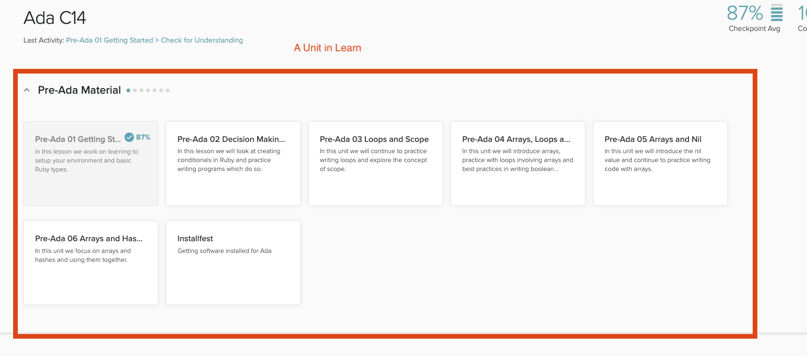
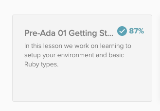
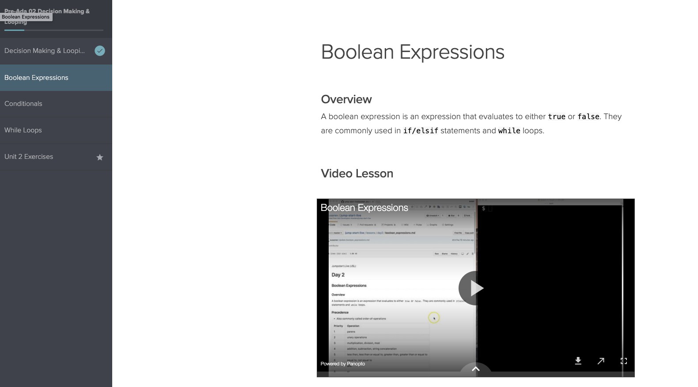
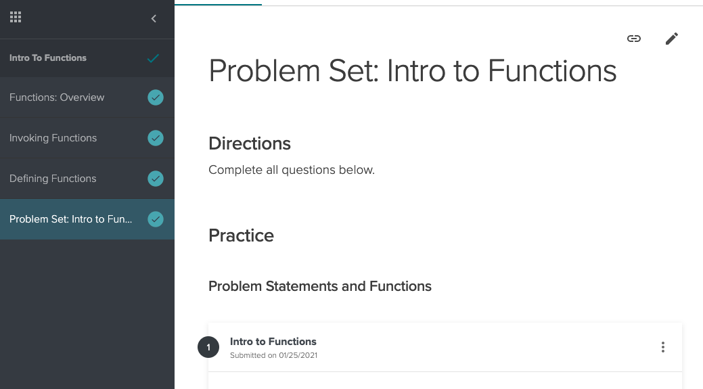
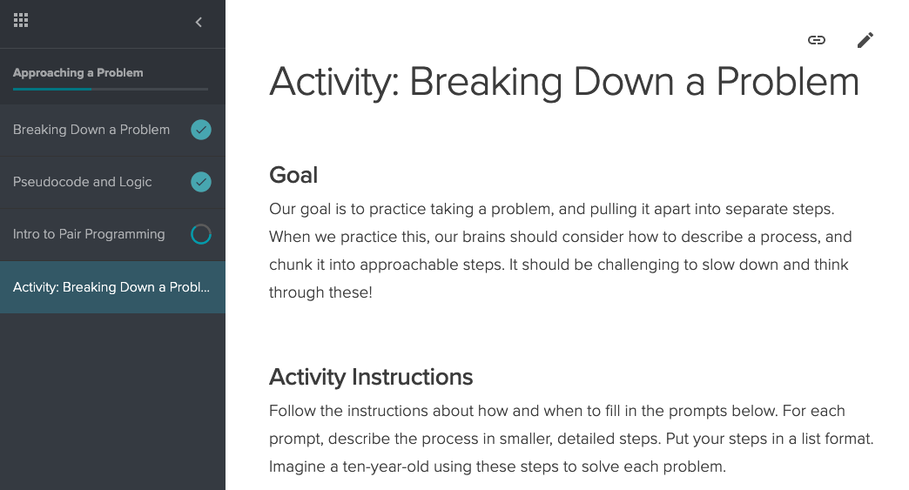

# Learn LMS

[Learn](http://learn-2.galvanize.com/) is a Learning Management tool, developed by [Galvanize](https://www.galvanize.com/) designed specifically for the needs of bootcamp students. Ada is excited to be using this tool for C15.

<iframe src="https://adaacademy.hosted.panopto.com/Panopto/Pages/Embed.aspx?id=1659fe90-a80e-457c-a081-ac18004c9f13&autoplay=false&offerviewer=true&showtitle=true&showbrand=false&start=0&interactivity=all" height="405" width="720" style="border: 1px solid #464646;" allowfullscreen allow="autoplay"></iframe>

## What's in Learn?

Learn contains:
- Curriculum
  - Lessons
  - Problem Sets
  - Activities
- Problem Sets
- Problem Solving Exercises (PSEs)
- Information About Ada
- Pre-Ada Material

## Curriculum Organization

### Units

The curriculum in Learn is organized into **Units**. Each unit is a major area of study at Ada. The Pre-Ada Material was such a area.

### Topics

Each section has a number of **topics** (those rectangles inside each section).

### Lessons

Each topic will have a number of lessons, text-based lessons on different topics with code examples and often interactive questions and activities.

You will also often be able to find videos embedded in the lesson with an instructor delivering the material and walking through examples.

### Problem Sets

Most topics will also often feature a problem set which can contain multiple choice, short-answer and long-answer questions as well as programming exercises. 

### Activities

 Many topics also include activities, which are group activities that will be fascilitated during roundtables.

 
