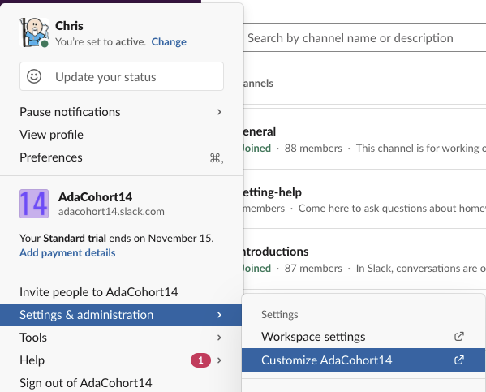
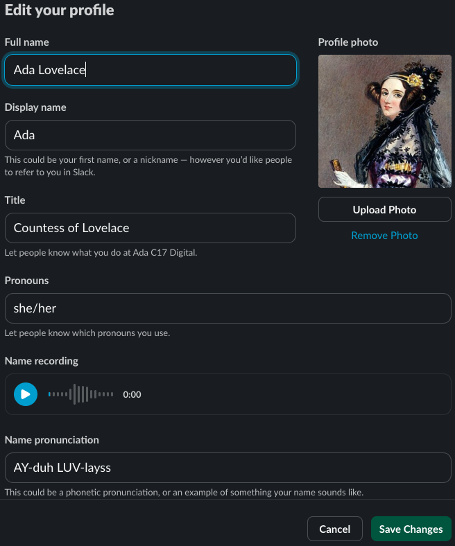

# Slack

At Ada and in the tech industry at large we use Slack. Slack is a messaging platform used to send text, ../assets and files. It also has limited support for video chat. You can use Slack in the browser by going to [slack.com](https://slack.com) and logging in. Alternatively you can install the [Slack Desktop Client](https://slack.com/downloads/mac) and use the [Slack App for IOS](https://apps.apple.com/us/app/slack/id618783545) or [Slack for Android](https://slack.com/downloads/android).

<iframe src="https://adaacademy.hosted.panopto.com/Panopto/Pages/Embed.aspx?id=dfb4214c-248e-4338-a3c3-ac1800560826&autoplay=false&offerviewer=true&showtitle=true&showbrand=false&start=0&interactivity=all" height="405" width="720" style="border: 1px solid #464646;" allowfullscreen allow="autoplay"></iframe>

## Slack Norms

1. **Use it!** Use it often and keep it open during core hours.
1. Continue to be kind, compassionate, and all other values that the Ada community stands for in text format.
1. Diligently read the official Ada channels. **We will use very frequently this to communicate announcements, updates, reminders, and questions.**
1. **Make Slack effective and helpful to you** (see tips).
1. Be responsive
   - When possible, respond as soon as you can, or inform the other person that you will respond later.
   - Respond to the best of your ability. Often times, the best response is "I don't know," "I'm not sure," "I need one day to reply to you," or "I need help."
1. Trust others
   - Trust others to respond when they can, as soon as they can, to the best of their ability.
1. Have a bias towards sharing what you have to say, asking questions, and asking for help often and frequently vs. not sharing, not asking questions, or not asking for help.

### Tips

- Mute conversations that you don't want notifications for.
- Use "Do Not Disturb" mode on your devices when you don't want to be notified.
- Join, create, and leave as many channels that are useful to you!
- Type in a way that is genuine to you: use any writing style, emoji, etc. that feels good.

## Sending and Reading Messages

You can select a channel or person in Slack and use the messaging panel at the bottom of the screen. You can use a variety of shortcuts to [format your message](https://slack.com/help/articles/202288908-Format-your-messages) as well.

### Private Messages

You can find other users in the Slack organization on the left-menu below the channels. You can use the `+` sign and type in the other user's name or names.

## Channels

You can find a list of Channels on the left menu. Each channel is a group conversation with one or more users. Each channel typically exists for a specific topic.

At ada we use a few channels for specific things:

- _annoucements_ - Used for Ada official annoucements about events, or curriculum.
- _csmemes_ - a channel to share funny memes or jokes about programming or technology.
- _pre-ada-homework_ - Used for discussions on the Pre Ada Material

### Creating Channels

You are welcome to create channels for discussions on a topic of interest. With discussions in Slack please remember and adhere to the Code of Conduct Expectations.

Like with users you can use the `+` sign to join channels you aren't currently in.

## Customizing Slack

You are welcome to customize slack by adding emoji.

Feel free to experiment and try settings in Slack.

### Adding Emojis

You can also add your own custom emoji to Slack. You are encouraged to do so, this Slack organization belongs to your cohort, and you are encouraged to make it your own.

### Updating Your Profile

You can view and update your profile in Slack including adding an avatar image.

#### User Avatar Image

Your avatar image **should be** an image that represents your appearance (so we can recognize you!) Consider a photo of yourself or a cartoon avatar that resembles you.

Tools you can use to generate a cartoon avatar:

- [Bitmoji](https://www.bitmoji.com/)
- [Picrew](https://picrew.me/) (Site is in Japanese, but buttons are decently clear.)

#### Status Icon

Slack lets you [set an emoji as part of your status](https://slack.com/help/articles/201864558-Set-your-Slack-status-and-availability).

We've added some emoji to our Slack that you can use if you want to indicate your pronouns:

-  `:she-her:`
-  `:they-them:`
-  `:he-him:`
-  `:they-she:`
-  `:ze-hir:`
-  `:xe-xir:`

If there are any other pronoun badges you would like let Kaida know, she's happy to make more!

If you would like to try your hand at making your own the ../assets are on [github](https://github.com/kaidamasaki/pronoun-badges).
