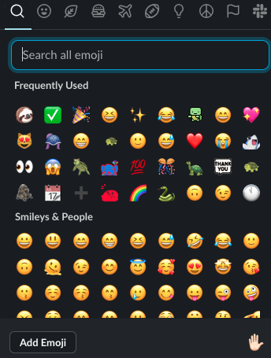
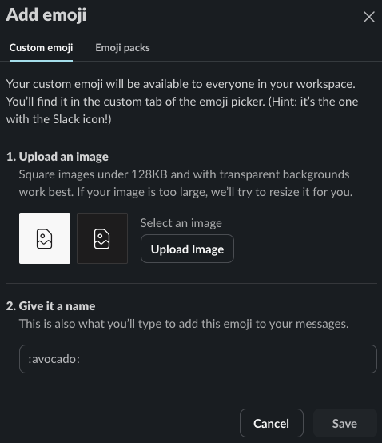

# Slack

At Ada and in the tech industry at large we use Slack. Slack is a messaging platform used to send text, ../assets and files. It also has limited support for video chat. You can use Slack in the browser by going to [slack.com](https://slack.com) and logging in. Alternatively you can install the [Slack Desktop Client](https://slack.com/downloads/mac) and use the [Slack App for IOS](https://apps.apple.com/us/app/slack/id618783545) or [Slack for Android](https://slack.com/downloads/android).

## Slack Norms

1. **Use it!** Use it often and keep it open during core hours.
1. Continue to be kind, compassionate, and all other values that the Ada community stands for in text format.
1. Diligently read the official Ada channels. **We will use very frequently this to communicate announcements, updates, reminders, and questions.**
1. **Make Slack effective and helpful to you** (see tips).
1. Be responsive
   - When possible, respond as soon as you can, or inform the other person that you will respond later.
   - Respond to the best of your ability. Often times, the best response is "I don't know," "I'm not sure," "I need one day to reply to you," or "I need help."
1. Trust others
   - Trust others to respond when they can, as soon as they can, to the best of their ability.
1. Have a bias towards sharing what you have to say, asking questions, and asking for help often and frequently vs. not sharing, not asking questions, or not asking for help.

### Tips

- Mute conversations that you don't want notifications for.
- Use "Do Not Disturb" mode on your devices when you don't want to be notified.
- Join, create, and leave as many channels that are useful to you!
- Type in a way that is genuine to you: use any writing style, emoji, etc. that feels good.

## Sending and Reading Messages

You can select a channel or person in Slack and use the messaging panel at the bottom of the screen. You can use a variety of shortcuts to [format your message](https://slack.com/help/articles/202288908-Format-your-messages) as well.

### Private Messages

You can find other users in the Slack organization on the left-menu below the channels. You can use the `+` sign and type in the other user's name or names.

## Channels

You can find a list of Channels on the left menu. Each channel is a group conversation with one or more users. Each channel typically exists for a specific topic.

You were automatically added to a number of channels when you joined the Slack for your cohort, such as `#announcements`, `#general`, and `#study-hall`. Check the description of each channel to see what it's for.

### Creating Channels

You are welcome to create channels for discussions on a topic of interest. With discussions in Slack please remember and adhere to the Code of Conduct Expectations.

After adding a channel, it's usually a good idea to make a post in `#general` to let other folks know the channel exists. Otherwise, it's likely that no one will know about it!

As with users you can use the `+` sign to join channels you aren't currently in. Before making your own channel, check to see if there is already a channel for the topic you are interested in.

## Customizing Slack

There are many settings in Slack that can be customized to your liking. Many settings can be accessed by clicking the `Settings...` option under the `Slack` menu item listed in the menu at the top of the desktop.

There are also additional settings that can be changed by other means.

### Adding Emojis

You can add your own custom emoji to Slack. You are encouraged to do so, this Slack organization belongs to your cohort, and you are encouraged to make it your own. Use the `Add Emoji` button displayed in the emoji picker to upload your own emoji.

  
*Fig. The emoji picker, where we can access the Add Emoji button*

  
*Fig. Upload your own images to use as emoji!*

### Updating Your Profile

You can view and update your profile in Slack including adding an avatar image.

  
*Fig. Your profile as shown in Slack*

  
*Fig. Editing your profile settings. Common elements to update include your display name, pronouns, and name pronunciation*

#### User Avatar Image

Your avatar image **should be** an image that represents your appearance (so we can recognize you!) Consider a photo of yourself or a cartoon avatar that resembles you.

Tools you can use to generate a cartoon avatar:

- [Bitmoji](https://www.bitmoji.com/)
- [Picrew](https://picrew.me/) (Site is in Japanese, but buttons are decently clear.)

#### Pronouns

You can add your pronouns to your profile in Slack. This can help others know how to refer to you.

Another way to indicate your pronouns is to include them in your Display Name or to use an emoji in your status.

Slack lets you [set an emoji as part of your status](https://slack.com/help/articles/201864558-Set-your-Slack-status-and-availability).

We've added some emoji to our Slack that you can use if you want to indicate your pronouns using a badge. They appear under the Custom Emoji section in the emoji picker.

#### Name Pronunciation

We recommend adding a name pronunciation to your profile. This can help others know how to pronounce your name.

You can provide a phonetic spelling of your name or a recording of you saying your name. Phonetic spelling can be a little tricky to decipher, so if you're comfortable, consider recording yourself saying your name.